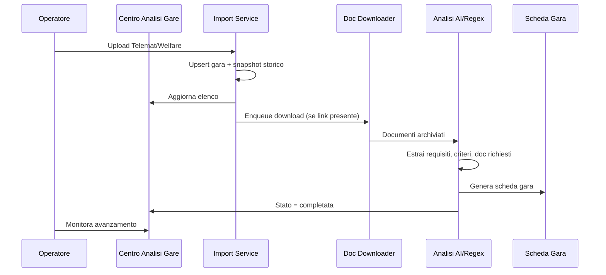

# Architettura funzionale — Piattaforma Gare Appalto

> **Priorità attuale (Fase 1):** motore automatico di raccolta, classificazione e studio delle gare.  
> **Fase 2 (non prioritaria):** gestione avanzata aziende, RTI, consorzi, avvalimenti e confronto partecipazione.

---

## Principio guida

La piattaforma è orientata **prima** all'analisi automatica delle gare e **solo successivamente** al confronto con le aziende candidate.

```
┌─────────────────────────────────────────────────────────────────┐
│  FASE 1 — Motore analisi gare (PRIORITÀ)                        │
│  Import → Storico → Download doc → Analisi → Scheda gara        │
└─────────────────────────────────────────────────────────────────┘
                              │
                              ▼
┌─────────────────────────────────────────────────────────────────┐
│  FASE 2 — Partecipazione e aziende (SUCCESSIVA)                 │
│  Compatibilità · RTI · Consorzi · Avvalimenti · Offerta tecnica │
└─────────────────────────────────────────────────────────────────┘
```

---

## Flusso prioritario (Fase 1)

| Step | Attività | Stato attuale | Prossimo sviluppo |
|------|----------|---------------|-------------------|
| 1 | Importazione report Telemat / Welfare | Telemat ✅ · Scouting ✅ · Welfare ❌ | Aggiungere fonte `welfare` |
| 2 | Acquisizione elenco completo gare pubblicate | Da file import | Estendere parser colonne (ente, link, durata) |
| 3 | Storico importazioni (stessa gara in giorni diversi) | Batch persistiti, CIG univoco per org | Modello `TenderImportSnapshot` per tracciare ogni rilevazione |
| 4 | Identificazione gare già presenti | Vincolo unique CIG (fallisce batch) | Upsert: aggiorna dati + crea snapshot |
| 5 | Download automatico documentazione da link | ❌ Non implementato | Campo `document_url` + task Celery downloader |
| 6 | Archiviazione documenti per gara | Upload manuale → MinIO/media | Tipizzazione doc (disciplinare, capitolato, allegato) |
| 7 | Analisi automatica disciplinare / capitolato / allegati | Regex post-upload | Pipeline LLM strutturata + trigger post-download |
| 8 | Creazione automatica scheda gara | Export on-demand PDF/DOCX | Persistenza `TenderScheda` JSON post-analisi |

### Vista operativa unificata

**Centro Analisi Gare** (`/analysis-hub`) — hub centrale Fase 1 che aggrega per ogni gara importata:

- elenco gare importate
- stato analisi
- documenti scaricati / elaborati
- requisiti individuati (per categoria)
- criteri tecnici individuati
- documenti richiesti (da regole formali)
- priorità assegnata

---

## Dati da estrarre per ogni gara (scheda)

### Dati generali

| Campo | Modello attuale | Note |
|-------|-------------------|------|
| oggetto | `Tender.oggetto` | ✅ |
| stazione appaltante | ❌ | Nuovo campo `stazione_appaltante` |
| CIG | `Tender.cig` | ✅ |
| CPV | `Tender.cpv` | ✅ |
| importo | `Tender.importo` | ✅ |
| durata | ❌ | Nuovo campo `durata` |
| scadenza | `Tender.scadenza` | ✅ |

### Requisiti

Mappati su `Requirement` con `categoria`:

| Sezione scheda | Categoria Requirement |
|----------------|----------------------|
| requisiti generali | `generale` |
| requisiti economico-finanziari | `economico_finanziario` |
| requisiti tecnico-professionali | `tecnico_professionale` |
| certificazioni richieste | `certificazione` |

### Offerta tecnica

Mappati su `EvaluationCriterion` (albero criterio → subcriterio → microcriterio):

- criteri, subcriteri, punteggi
- elementi premianti (`elementi_premianti` JSON)
- limiti formali (`Tender.formal_rules`: pagine, font, margini, allegati)

### Offerta economica

Parzialmente in `Requirement` (tipo `economico`) e `formal_rules`.  
Da estendere con modello dedicato o sezione JSON in scheda.

### Documenti richiesti

Da `formal_rules.allegati` + requisiti documentali.  
Da tipizzare: amministrativi / tecnici / economici.

---

## Componenti software

### Backend (Django)

```
backend/
├── tenders/                    # Dominio gare (core Fase 1)
│   ├── models.py               # Tender, Document, Requirement, EvaluationCriterion
│   ├── tasks.py                # Import batch, process document
│   └── services/
│       ├── import_parser.py    # Parser CSV/XLS Telemat/Scouting
│       ├── extraction.py       # Estrazione metadati da testo
│       ├── requirement_extraction.py
│       ├── criterion_extraction.py
│       └── export/collector.py # Scheda gara (export)
├── api/
│   └── services/
│       ├── kpis.py             # Dashboard KPI
│       └── analysis_hub.py     # Centro Analisi Gare (aggregato)
├── companies/                  # Fase 2
├── participations/             # Fase 2
└── ai/                         # LLM (Fase 1 analisi + Fase 2 OT)
```

### Frontend (React)

```
frontend/src/
├── pages/
│   ├── TenderAnalysisHub.tsx   # Centro Analisi Gare ★ entry point Fase 1
│   ├── TelematUpload.tsx       # Import Telemat
│   ├── ScoutingDashboard.tsx   # Import Scouting + scoring
│   └── TenderDetail.tsx        # Dettaglio gara (analisi + export)
└── components/AppLayout.tsx    # Nav: Analisi gare prima di Partecipazione
```

### API principali (Fase 1)

| Endpoint | Scopo |
|----------|-------|
| `POST /api/telemat/imports/` | Import report Telemat |
| `POST /api/scouting/imports/` | Import report Scouting |
| `GET /api/analysis-hub/` | Vista aggregata Centro Analisi Gare |
| `GET /api/tenders/?imported=true` | Elenco gare importate |
| `POST /api/tenders/{id}/documents/` | Upload documenti gara |
| `GET /api/tenders/{id}/requirements/` | Requisiti estratti |
| `GET /api/tenders/{id}/evaluation-criteria/` | Criteri tecnici |

### API Fase 2 (deprioritizzate in navigazione)

| Endpoint | Scopo |
|----------|-------|
| `/api/companies/` | Anagrafica aziende |
| `/api/tenders/{id}/evaluations/` | Compatibilità azienda-gara |
| `/api/participations/` | RTI, consorzi, avvalimenti |

---

## Pipeline dati target (Fase 1 completa)



---

## Roadmap implementativa

### Sprint corrente (locale)

- [x] Documento architettura funzionale
- [x] API `GET /api/analysis-hub/`
- [x] Pagina **Centro Analisi Gare**
- [x] Navigazione riorganizzata (analisi gare in evidenza)
- [x] Fonte import **Welfare** + colonne estese parser
- [x] **TenderImportSnapshot** + upsert su re-import
- [x] Campi `stazione_appaltante`, `durata`, `document_url` su Tender
- [x] Task Celery **download automatico** documentazione
- [x] Tipizzazione documenti (disciplinare / capitolato / allegato)
- [x] **Scheda gara persistita** (`Tender.scheda`) post-analisi

### Prossimi incrementi

1. Sezione offerta economica strutturata
2. Analisi LLM strutturata (oltre regex)
3. Download multi-documento da portali complessi

### Fase 2 (quando richiesto)

- Matrice requisiti vs aziende
- Analisi partecipazione RTI/consorzio/avvalimento
- Compatibilità automatica multi-azienda

---

## Note deployment

Le modifiche descritte in questo documento sono sviluppate e testate **in ambiente locale**. Il deploy in produzione avverrà in un secondo momento, su richiesta esplicita.
